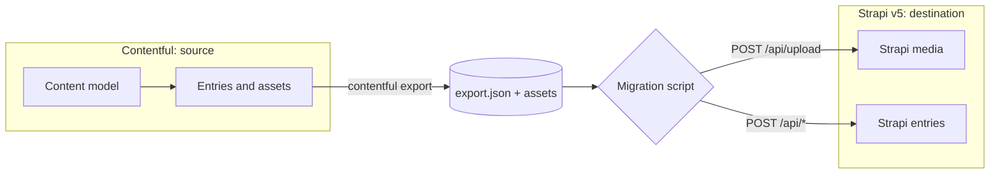
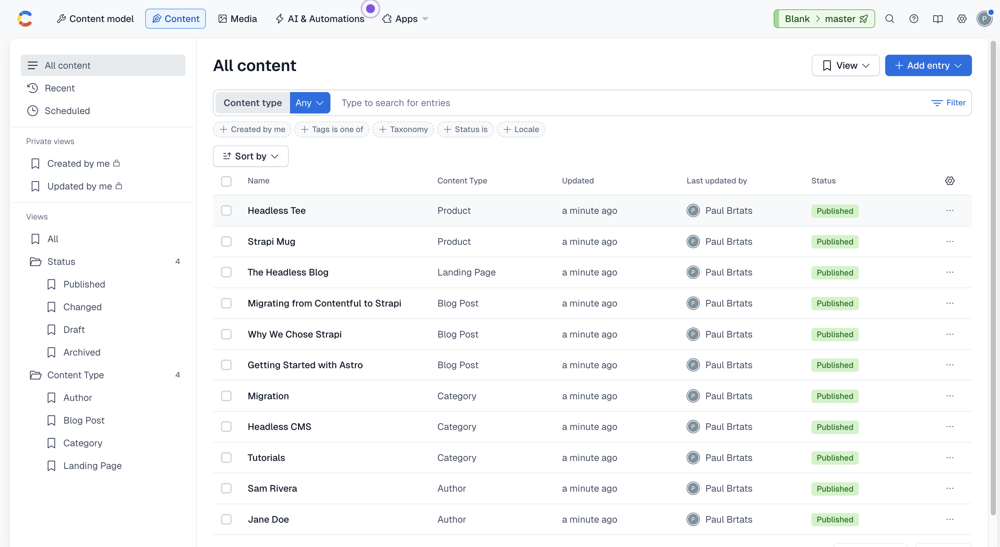
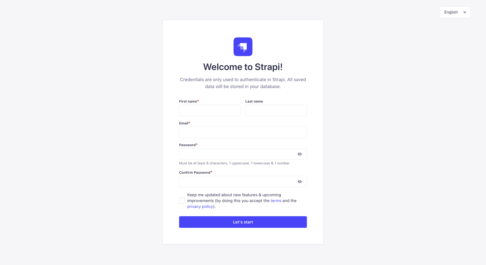
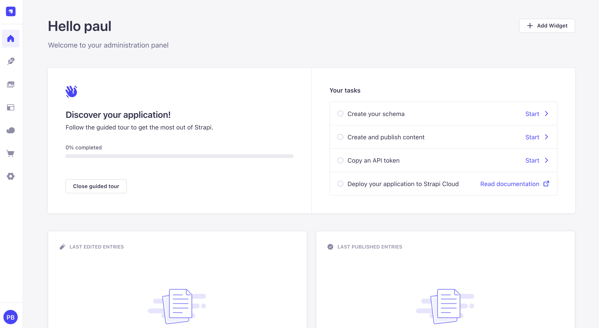
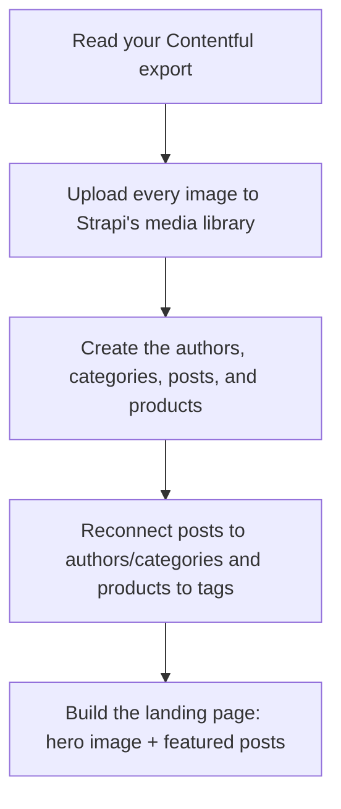

**TL;DR**

- By the end, you'll have moved a whole site out of **Contentful** and into **Strapi**: a blog (landing page, posts, authors, categories) **and a product catalog**. And you'll have done it yourself.
- You won't write migration code. You point an AI skill (for [Claude Code](https://claude.com/claude-code)) at your Contentful content, and it reads your model and does the move, whether that's a blog, products, or whatever you've got.
- Everything comes across: your formatted text, your images, and the links between things (which post belongs to which author and category, and which posts are featured on the home page).
- The takeaway: with today's AI tools, leaving Contentful isn't a scary engineering project anymore.
- The repo gives you a sample Contentful space to practice on plus the skill that does the migration, so you can try the whole thing start to finish.

> **Contentful is being acquired by Salesforce.** As I write this, Contentful has [signed a definitive agreement to be acquired by Salesforce](https://www.contentful.com/blog/a-new-chapter-for-contentful/). What that means, in my opinion:
>
> - **Distribution win for Contentful.** It rides Salesforce's enterprise machine: no separate procurement cycle, and instant reach into big accounts.
> - **Less of the developer-first "cool" Contentful** that people fell for. Acquired products tend to drift toward the parent company's priorities.
> - **More expensive, and likely the end of self-serve.** Salesforce sells to enterprises, so expect pricing and focus to follow. Don't rule out them sunsetting Contentful entirely down the road. They did, after all, gut Heroku's beloved free tier after acquiring it.
>
> This is my opinion, not a prediction. But if any of it rings true, the safe move is to make sure your content isn't locked into someone else's platform. That's exactly what this guide is about.

## Why move from Contentful to Strapi?

Contentful is a hosted headless CMS. Teams usually start looking elsewhere for a few reasons:

- **Pricing that grows with the team.** You pay per seat and per record.
- **Content-model limits on the lower tiers.**
- **You don't host your own data.** It lives on Contentful's servers, not yours.

[Strapi](https://strapi.io) is the most popular open-source alternative. You self-host it (or use Strapi Cloud), you own the database, and the REST and GraphQL APIs are yours to customize.

The [Salesforce acquisition](https://www.contentful.com/blog/a-new-chapter-for-contentful/) only sharpens these reasons. Co-founder Sascha Konietzke pitches Contentful's structured content as the layer for Salesforce's Agentforce, [writing that "AI agents now outnumber humans on the Web."](https://www.contentful.com/blog/a-new-chapter-for-contentful/) Whichever way that goes, owning your content keeps the choice yours.

The difference shows up the moment you sit down to build:

- **Contentful is software-as-a-service.** There's no way to run it locally or offline. Even to read your own content model, you create an account and authenticate against Contentful's servers. That's why the setup below makes you sign up and run `contentful login`.
- **Strapi is the opposite: fully self-hosted.** You run it on your own machine with `npm run develop`, the data lives in your own database, and no account or login to anyone's servers is required.

That ownership is the whole point of the move, and you'll feel it in this tutorial: the source side needs a hosted account, and the destination side is just a process on `localhost`.

The catch: the two systems model content differently enough that you can't just copy a database table across. We'll walk through a real migration of a small blog, and you get a project you can run end to end.

Here's the shape of what we're building:



## Before you begin: set up your tools

**Goal of this section:** get everything installed and authenticated so the later steps
just work. None of it assumes you've used Contentful or Strapi before. Four steps.

**1. Install Node.js (version 18.18 or newer)** from [nodejs.org](https://nodejs.org), then confirm:

```bash
node -v        # should print v18.18 or higher
```

**2. Get the example code.** Clone the companion repo and move into it:

```bash
git clone https://github.com/PaulBratslavsky/contentfull-to-strapi-migration-post.git contentful-to-strapi
cd contentful-to-strapi
```

Inside you'll find `playground/contentful-seed/` (scripts to spin up a sample Contentful
space) and `.claude/skills/contentful-to-strapi-migration/` (the skill that does the
migration). That's the whole project.

**3. Create a free Contentful account.** Because Contentful is hosted, there's no local
option: you need an account on their servers even to define a content model. Go to
[contentful.com](https://www.contentful.com/), click **Sign up** (the free tier is plenty
for this tutorial; no credit card required), and verify your email. That's all you need
here. Step 4 handles the space and token from the CLI.

> **Why an account is unavoidable here.** Contentful is software-as-a-service: you can't
> spin it up locally, so reading or exporting your own content always goes through their
> hosted API and requires logging in. Strapi (the destination) is the mirror image:
> fully self-hosted, runs on `localhost`, and needs no account at all. It's the same reason
> teams migrate in the first place.

**4. Install the Contentful CLI, then log in.** Part 1 (creating the content model and
exporting your space) is driven by the **[Contentful CLI](https://www.contentful.com/developers/docs/tutorials/cli/)**, so set it up now. Two actions:

**4a: Install the CLI** (skip if you already have it; confirm with `contentful --version`):

```bash
npm install -g contentful-cli
contentful --version              # confirm it's on your PATH
```

**4b: Log in.**

```bash
contentful login

A browser window will open where you will log in (or sign up if you don’t have an account), authorize this CLI tool and paste your CMA token here:

? Continue login on the browser? Yes
? Paste your token here: *******************************************

Great! You've successfully logged in!
```

**4c: Use your included space.** Contentful's [Free plan includes **1 Starter Space**](https://www.contentful.com/pricing/). List your spaces and set that one active:

```bash
# shows your space(s) and their IDs
contentful space list   

┌────────────┬──────────────┐
│ Space name │ Space id     │
├────────────┼──────────────┤
│ Blank      │ pwomps5x1tsi │
└────────────┴──────────────┘
```

Use your id in next step.

```
# make it the active space
contentful space use --space-id <id-from-list>
``` 

> **Heads up on `contentful space create`.** If you already have your one included space,
> creating another is a paid action. The CLI warns _"adding new spaces … will result in
> extra monthly charges"_ and asks you to confirm. On the Free plan, answer `n` and just
> `space use` the space you already have. (If that space already holds content you care
> about, note that the seed step adds the sample blog's content types and entries to it.
> Use a throwaway space if you'd rather keep them separate.)

> **No global install?** Prefix every `contentful` command with `npx -y contentful-cli`
> (for example, `npx -y contentful-cli space list`) and skip step 4a.

With Node, the code, and the CLI logged in against your space, you're ready to **seed your
Contentful content. That's Part 1.** (We create the Strapi destination later, in Part 2.)

## How the two CMSes line up

Before writing any code, map the concepts. Most of a migration is just deciding what becomes what.

| Contentful             | Strapi v5              | Notes                                           |
| ---------------------- | ---------------------- | ----------------------------------------------- |
| Content Type           | Collection Type        | A type with many entries (blog posts, authors). |
| A single special entry | Single Type            | One-of-a-kind content like the landing page.    |
| Entry                  | Document               | In v5, the stable identity is the `documentId`. |
| Asset (on the CDN)     | Media (Upload library) | Must be re-uploaded; URLs change.               |
| Reference (Link)       | Relation               | Reconnected after entries exist.                |
| Rich Text (JSON AST)   | Rich text (Blocks)     | The skill converts the tree into Strapi's native block format. |
| Array of strings (tags) | Collection + relation | Free-text lists are promoted to their own type so they're reusable. |

For our sample that means: `blog-post`, `author`, `category`, and `product` as **collection
types**; `landing-page` as a **single type**; and a `tag` collection the skill promotes from
the products' free-text tags.

### One extra field that makes life easy: `contentfulId`

Add a plain string field called `contentfulId` to every destination type. We store each record's original Contentful id there. 

It costs nothing and buys two things. First, the migration becomes **idempotent**: re-running it updates the same record instead of creating a duplicate. Second, you keep a paper trail back to the source if you need to debug later. It's the same trick the [community `strapi_lift` guide](https://strapi.io/blog/migrate-from-contenful-to-strapi) relies on. Once the migration is done and you're sure you won't need to re-import, you can safely drop the field.

## Part 1 — Seed a sample Contentful space

**Goal of this section:** end up with a Contentful space holding a small sample site, then
export it to a file we can migrate. The sample is a blog (three posts, two authors, three
categories, a landing page, images) **and a product catalog** (a couple of products with
price, SKU, image, and tags). The product collection is there on purpose: it shows the skill
reads *your* model and isn't limited to a blog. (It even promotes the products' free-text
`tags` into their own `tag` collection on the Strapi side.)

The seed project already lives in `playground/contentful-seed/`. Run these four commands in
order:

```bash
cd playground/contentful-seed
npm install        # 1. install the seed project's dependencies
npm run model      # 2. create the content types in your Contentful space
npm run seed       # 3. add and publish the sample posts, authors, categories, and images
npm run export     # 4. download it all to ./export/export.json (the file you'll migrate)
```

The commands reuse the credentials from your `contentful login` in setup, so there's nothing
else to configure. Open your space in the Contentful web app and you'll see the seeded
blog; `playground/contentful-seed/export/export.json` is what you hand to the skill in Part 2.



## Part 2 — Migrate into Strapi with the skill

**Goal of this section:** stand up a Strapi v5 project and hand the migration to the
**`contentful-to-strapi-migration` skill**. You point it at the export from Part 1; it reads
your content model, creates matching content types in Strapi (rich text as the native
**Blocks** editor), builds the migration for *your* data, and runs it.

**Step 2.1: Create a Strapi project.** Use Strapi's official generator:

```bash
npx create-strapi-app@latest my-strapi-blog --non-interactive
cd my-strapi-blog
npm run develop  
```

Create your first admin user.



Once you login, you weill be greeted with the dashboard.

Leave it running; the admin panel is at `http://localhost:1337/admin`.



**Step 2.2: Run the skill.** With the Strapi dev server still running, open
[Claude Code](https://claude.com/claude-code) **at the repo root**. From there it can see
both your export and the Strapi project, and the skill (shipped at
`.claude/skills/contentful-to-strapi-migration/`) is picked up automatically. Then give it a
prompt with the two paths:

```text
Use the contentful-to-strapi-migration skill to migrate my Contentful export into Strapi. The export is at playground/contentful-seed/export/export.json and its downloaded images are in playground/contentful-seed/export/. My Strapi v5 project is at ./my-strapi-blog, running at http://localhost:1337. Create the content types, set up a write API token, and create a migration script that I can run. 
```

Here's what the skill does for you, start to finish:

1. **Reads your Contentful model** from the export: every content type, field, and relationship.
2. **Creates matching Strapi content types**, picking the right field for each: a **Rich text (Blocks)** field for rich text, single **media** fields for images, **relations** for references, a **single type** for one-off pages like the landing page, and a `contentfulId` on every type so the migration can re-run safely. (For our sample that's `blog-post`, `author`, `category`, and `product` collections, a `landing-page` single type, and a `tag` collection the skill promotes from the products' free-text tags.)
3. **Sets up access**: a write API token plus public read on the new types, so you can check the result with a plain `curl`.
4. **Generates the migration script for your data** on top of a tested engine (rich-text→Blocks conversion, asset upload, a Strapi REST client) that ships with the skill, then **hands you the exact command to run it.** It doesn't run automatically, so you can open the script and config and review them first. When you run it, it prints a summary of what moved.

Because it works from *your* model, the skill isn't limited to this blog. Point it at any Contentful space and it shapes both the Strapi content types and the migration to match.

That's the whole idea: the skill *builds* the migration script for you to review and run, you don't hand-write one.

## How the skill works, step by step

The skill follows a fixed pipeline. Every stage runs the same way each time, with one human
checkpoint in the middle where you review the plan before anything is written to Strapi.
Here's the run that produced the blog and product catalog above.

**1. It reads your export and your Strapi project.** It detects whether the project is
TypeScript or JavaScript, so the files it generates match, and it confirms the dev server is
up.

**2. It analyzes the export and prints a plan** of every content type, every field, and the
Strapi type it proposes for each:

```text
Migration plan  (locale: en-US)
5 content types · 11 entries · 16 assets
```

It also flags the judgment calls, like a free-text list of tags that could become its own
collection.

**3. You review the plan. This is the checkpoint.** It's the one place a real decision gets
made. In this run, both `blogPost.tags` and `product.tags` held plain strings, so the skill
promoted them into a single shared `tag` collection with relations, instead of leaving them
as raw JSON. (Collections beat JSON for anything reusable.)

**4. It generates the Strapi schema.** It writes the content-type files (TypeScript here),
and Strapi's dev server hot-reloads them. Six types appear and their routes go live:

```text
  + author (collection)
  + category (collection)
  + blog-post (collection)
  + product (collection)
  + landing-page (single)
  + tag (collection, promoted)
```

**5. It sets up read access and a write token.** A bootstrap grants the public role read
access so you can check the result with `curl`, and you supply a Full access API token for
the migration to write with.

**6. It hands you the migration script to run.** The skill stops here. You run the script
yourself, and it works in four passes, then prints a summary:

```text
[1/4] Uploading assets to the media library...
[2/4] Promoting tag-like fields to collections...
[3/4] Creating entries (no cross-entry relations yet)...
[4/4] Linking relations...

Migration complete:
  tags          12
  authors        2
  categories     3
  blog-posts     3
  landing-page   1
  products       2
```

That's the whole pipeline: analyze, review, generate, then run. The only step that needs
your judgment is the review in the middle. Everything else is identical on every run, which
is what makes the result predictable.

## Part 3 — What the skill handles for you

You don't have to write any of this. But it's worth seeing what the skill does behind the
scenes, because it's the same three things every migration comes down to. Seeing them turns
"magic" into "I get it."

It works in order so nothing ever points at something that doesn't exist yet: bring the
images over, create the entries, then connect them up.



### Formatted text → Strapi Blocks

Contentful keeps rich text as a structured tree: a heading here, a bold word there, an
image in the middle. Strapi's native **Rich text (Blocks)** editor has its own structure,
and the skill translates one into the other: headings, lists, links, quotes, bold/italic,
and inline images all carry over. Images that were sitting inside the body get repointed to
their new home in Strapi's media library, so nothing breaks after the move. This is the
fiddliest part of any migration, which is exactly why it's built into the skill instead of
being something you write.

### Images → Strapi's media library

Your images live on Contentful's CDN; Strapi keeps its own copy. The skill brings each image
into Strapi's media library and then attaches it to the entry that uses it. Those are two
quick steps, and it does both for you.

One thing worth knowing: Contentful's CDN can resize and optimize images on the fly, while
Strapi's media library serves fixed sizes. If on-the-fly resizing matters to you, point
Strapi at a CDN that does it. There's an official
[Cloudinary provider](https://docs.strapi.io/cms/configurations/media-library-providers/cloudinary)
for exactly that.

### Relationships → reconnected

In Contentful, a post points at its author and category, and the home page points at its
featured posts. The skill creates every entry first, remembers where each one landed, then
reconnects those relationships, so a post always finds its author and the home page finds
its featured posts. The product catalog works the same way: each product reconnects to the
`tag` records the skill promoted from its free-text tags, so a list of strings becomes a
real, reusable relation. And because every migrated entry remembers where it came from, you
can re-run the whole migration as often as you like without ever creating duplicates.

## The whole run, in order

The complete sequence in one place, from seeding to verifying. Do the
[tool setup](#before-you-begin-set-up-your-tools) first (Node, the repo, `contentful login`,
`space use`), then:

```bash
# Source — seed a sample Contentful space and export it (Part 1)
cd playground/contentful-seed
npm install
npm run model               # create the content model in your space
npm run seed                # create + publish the sample entries and images
npm run export              # writes ./export/export.json + downloaded images

# Destination — create a Strapi project (Part 2)
cd ../..
npx create-strapi-app@latest my-strapi-blog --non-interactive
cd my-strapi-blog
npm run develop             # create your admin user, then leave it running
```

Then, in [Claude Code](https://claude.com/claude-code), run the skill:

```text
Use the contentful-to-strapi-migration skill to migrate my Contentful export at
playground/contentful-seed/export/export.json into the Strapi project at ./my-strapi-blog
(running at http://localhost:1337). Create the content types, set up a write API token,
and generate the migration script for me to review and run.
```

The skill stops once the script is ready. Review `migrate/migrate.js` and the generated
`migration.config.json`, then run it yourself:

```bash
cd migrate
node migrate.js --export ../playground/contentful-seed/export/export.json --config migration.config.json
```

```bash
# Verify — the migration also prints a summary of what moved when it finishes
curl http://localhost:1337/api/blog-posts     # posts with author, category, cover image
curl http://localhost:1337/api/landing-page   # hero + featured posts
curl http://localhost:1337/api/products       # products with price, SKU, image, tag relations
```

!

Open a post's `body` and you'll see Strapi Blocks, with any in-body image pointing at a
`/uploads/...` URL on your own server. Run the migration again and the counts stay the
same: every entry remembers where it came from, so a re-run updates rather than duplicates.

That's it. **Your whole site now lives in Strapi**: the blog (posts, authors, categories,
images, and the landing page) and the product catalog (with tags as a real relation), with
formatted text as Strapi Blocks and every relationship reconnected.

## Make the skill your own

The skill ships in this repo at
[`.claude/skills/contentful-to-strapi-migration/`](./.claude/skills/contentful-to-strapi-migration),
so Claude Code finds it automatically when you open the project. It's deliberately a
**starting point, not a one-size-fits-all migrator**. It knows this sample blog's shape, and
it reads your Contentful export to adapt. Point it at a different space and it builds the
matching content types and migration for that model. Want to change how something maps? Just
tell Claude; the skill is yours to adapt.

One adaptation worth knowing about: Strapi 5.47+ ships an
[**MCP server**](https://docs.strapi.io/cms/features/strapi-mcp-server) that lets an AI
client create, update, and publish **entries** (and wire up relations) natively. This skill
creates entries over the REST API, which needs nothing but a token. But if you'd rather
have Claude create the content through the Strapi MCP, enable it
(`mcp: { enabled: true }` in `config/server.js`, connect via `/mcp` with an admin token) and
tell Claude to use it for the entry step. Note the MCP **doesn't create content types or
upload media**, so the collection setup and image upload still happen the way they do here.
That's exactly the kind of thing you'd adjust in your own copy of the skill.

New to agent skills and want to build your own? Strapi has a friendly primer:
[**What are agent skills and how to use them**](https://strapi.io/blog/what-are-agent-skills-and-how-to-use-them).


## Scaling up to a real migration

The script in this post is deliberately small and readable so you can see exactly what each step does. It's perfect for a blog with hundreds of entries, and a solid base to extend. For a large production migration (thousands of entries, gigabytes of assets, resumable runs, structured logging), it's worth knowing about purpose-built tooling.

A community guide on the Strapi blog, [**Migrate from Contentful to Strapi**](https://strapi.io/blog/migrate-from-contenful-to-strapi) by Tim Adler, is built around [`strapi_lift`](https://github.com/toadle/strapi_lift), his open-source migration tool. It documents a real migration of roughly 2,000 entries and 11 GB of assets that took about seven hours, and adds things you'd eventually want at scale:

- **Resumable, idempotent imports.** Interrupt it and restart: it checks each entry by `contentfulId` and updates rather than duplicates.
- **Subset testing.** Flags like `--content-types articles:10,categories`, `--ids`, and `--skip` let you rehearse on a slice before the full run.
- **Asset repair.** A `fix-assets` command re-downloads the 0-byte assets a flaky export leaves behind.
- **A `reset` command** to wipe imported content and start clean.
- **Structured `log.jsonl`** you can slice with `jq` (`jq 'select(.level=="error")'`) to trace which entry actually caused a failure.

The trade-off is configuration: you describe each content type with a per-type mapper plus an "intermediate model," and you write a small "link" class for every kind of relation so the tool knows how to resolve it. That's more upfront setup than our single mapping file: the cost of being general. Same three hard parts under the hood, just industrialized.

A rough rule of thumb:

- **Hand-roll** (like this post) when you want full control, your content model is small-to-medium, and you're comfortable in Node. You'll understand every transformation, which matters most for the rich-text and asset edge cases that are unique to your content.
- **Use a tool** like `strapi_lift` when the volume is large, you need restartable runs and audit logs out of the box, and you'd rather configure than write the plumbing.

Either way the hard parts are the same three we covered here: rich text, assets, and relations. Once you understand them, the tool you pick is just a delivery mechanism.

**Citations**

- Migrate from Contentful to Strapi (community guide on the Strapi blog, by Tim Adler): https://strapi.io/blog/migrate-from-contenful-to-strapi
- strapi_lift migration tool: https://github.com/toadle/strapi_lift
- What are agent skills and how to use them (Strapi blog): https://strapi.io/blog/what-are-agent-skills-and-how-to-use-them
- A New Chapter for Contentful: Scaling Our Vision with Salesforce (Sascha Konietzke, Contentful): https://www.contentful.com/blog/a-new-chapter-for-contentful/
- Salesforce Signs Definitive Agreement to Acquire Contentful (Salesforce newsroom): https://www.salesforce.com/news/stories/salesforce-signs-definitive-agreement-to-acquire-contentful/
- Strapi REST API reference: https://docs.strapi.io/cms/api/rest
- Strapi Upload API: https://docs.strapi.io/cms/api/rest/upload
- Strapi — managing relations with the REST API: https://docs.strapi.io/cms/api/rest/relations