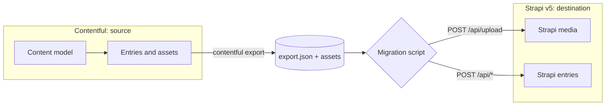
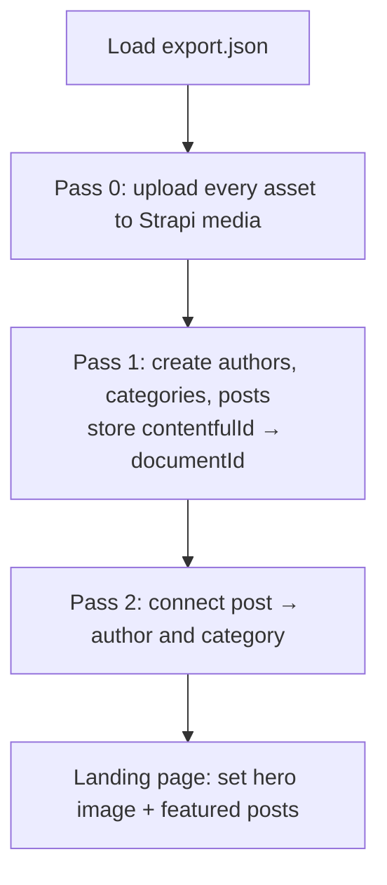

**TL;DR**

- This guide moves a whole blog — a landing page, blog posts, authors, categories, and images — from **Contentful** to **Strapi v5**, with a runnable code example you can follow along with.
- The migration is a small Node script. It reads a Contentful **export** file and writes to Strapi over the REST API. No vendor lock-in, no proprietary tool.
- Three things make a CMS migration tricky, and we solve each one: **rich text** (Contentful's JSON tree becomes Markdown), **assets** (downloaded from Contentful's CDN and re-uploaded to Strapi), and **relations** (reconnected in a two-pass pass so nothing points at a record that doesn't exist yet).
- Strapi v5 has a few sharp edges that trip up old tutorials: entries are addressed by `documentId`, you can't attach a file while creating an entry, and media fields are set by a numeric file id (not the relation `connect` syntax). We cover all three.
- The full, working project lives in [`playground/`](./playground): a Strapi destination, scripts to seed a sample Contentful space, and the migration tool with a bundled sample export so you can run it immediately.

> **What this means (in my opinion).** As I write this, Contentful has [signed a definitive agreement to be acquired by Salesforce](https://www.contentful.com/blog/a-new-chapter-for-contentful/). My read on what that brings:
>
> - **Distribution win for Contentful.** It rides Salesforce's enterprise machine — no separate procurement cycle, instant reach into big accounts.
> - **Less of the developer-first "cool" Contentful** that people fell for. Acquired products tend to drift toward the parent company's priorities.
> - **More expensive, and likely the end of self-serve.** Salesforce sells to enterprises, so expect pricing and focus to follow — and don't rule out them sunsetting Contentful entirely down the road. They did, after all, gut Heroku's beloved free tier after acquiring it.
>
> That's opinion and prediction, not prophecy. But if any of it rings true, the safe move is to make sure your content isn't locked into someone else's platform — which is exactly what this guide is about.

## Why move from Contentful to Strapi?

Contentful is a polished, hosted headless CMS. Teams usually start looking elsewhere for a few reasons: per-seat and per-record pricing that grows with the team, content-model limits on lower tiers, and the simple fact that you don't host your own data. [Strapi](https://strapi.io) is the most popular open-source alternative — you self-host it (or use Strapi Cloud), you own the database, and the REST and GraphQL APIs are yours to customize.

As noted up top, the [Salesforce acquisition](https://www.contentful.com/blog/a-new-chapter-for-contentful/) only sharpens these reasons — co-founder Sascha Konietzke pitches Contentful's structured content as the layer for Salesforce's Agentforce, [writing that "AI agents now outnumber humans on the Web."](https://www.contentful.com/blog/a-new-chapter-for-contentful/) Whichever way that goes, owning your content keeps the choice yours.

The difference shows up the moment you sit down to build. **Contentful is software-as-a-service: there's no way to run it locally or offline.** Even to read your own content model you have to create an account and authenticate against Contentful's servers — which is exactly why the setup below makes you sign up and run `contentful login`. **Strapi is the opposite: it's fully self-hosted.** You run it on your own machine with `npm run develop`, the data lives in your own database, and no account or login to anyone's servers is required. That ownership is the whole point of the move — and you'll feel it in this tutorial, where the source side needs a hosted account and the destination side is just a process on `localhost`.

The catch is that the two model content differently enough that you can't just copy a database table across. This post walks through a real migration of a small blog and gives you a project you can run end to end.

Here's the shape of what we're building:



## Before you begin: set up your tools

**Goal of this section:** get everything installed and authenticated so the later steps
just work. None of it assumes you've used Contentful or Strapi before. Five steps.

**1. Install Node.js (version 18.18 or newer).** The scripts use Node's built-in
`fetch`, `FormData`, and `Blob`, which need a recent version. Download it from
[nodejs.org](https://nodejs.org), then confirm:

```bash
node -v        # should print v18.18 or higher
```

**2. Get the example code.** Clone the companion repo and move into it:

```bash
git clone https://github.com/PaulBratslavsky/contentfull-to-strapi-migration-post.git contentful-to-strapi
cd contentful-to-strapi
```

Inside you'll find a `playground/` with three folders: `contentful-seed/` (the source),
`strapi-server/` (the destination), and `migrate/` (the migration tool).

**3. Create a free Contentful account and space.** Because Contentful is hosted, there's
no local option here — you need an account on their servers even to define a content
model. If you don't have one yet:

1. Go to [contentful.com](https://www.contentful.com/) and click **Sign up** (the free
   tier is plenty for this tutorial; no credit card required).
2. Verify your email and finish onboarding. Contentful usually creates a first space for
   you; if not, click **Add space → Create an empty space** and give it a name.
3. Grab your **Space ID**: in that space, go to **Settings → General settings** and copy
   the *Space ID* value. You'll point the CLI at it in the next step.

You do **not** need to create an API token by hand — the CLI login in step 4 generates one
for you.

> Only doing the quick demo run? You can skip steps 3–4 entirely: the `migrate/` folder
> ships with a sample export, so you don't need a Contentful account to watch the migration
> work against your local Strapi.

> **Why an account is unavoidable here.** Contentful is software-as-a-service — you can't
> spin it up locally, so reading or exporting your own content always goes through their
> hosted API and requires logging in. Strapi (the destination) is the mirror image: it's
> fully self-hosted, runs on `localhost`, and needs no account at all. Same reason teams
> migrate in the first place.

**4. Install the Contentful CLI, then log in.** Part 1 (creating the content model and
exporting your space) is driven by the **[Contentful CLI](https://www.contentful.com/developers/docs/tutorials/cli/)** — it's a required tool, so install it first if you don't already have it:

```bash
npm install -g contentful-cli     # install globally
contentful --version              # confirm it's on your PATH
```

> Can't or don't want a global install? Skip the install and prefix the commands with
> `npx`, e.g. `npx -y contentful-cli login`. Same result.

Logging in is also how you get a credential:
[`contentful login`](https://www.contentful.com/developers/docs/tutorials/cli/authentication/)
opens a browser, and on authorizing it **generates a Content Management token and stores it**
(along with your active space) in `~/.contentfulrc.json`:

```bash
contentful login                                   # browser authorize -> stores a CMA token
contentful space use --space-id <your-space-id>    # stores your active space
```

That's the whole auth setup. The seed and export scripts read those stored credentials
automatically — **nothing to copy or paste.** (Prefer explicit credentials, e.g. for CI?
Generate a personal token under **Settings → API keys → Content management tokens** and
put it in `playground/contentful-seed/.env` as `CONTENTFUL_MANAGEMENT_TOKEN`; env values
override the CLI config.)

**5. Strapi needs nothing installed globally.** The `strapi-server/` project brings its
own dependencies; you'll start it with `npm run develop` later. With Node, the code, a
Contentful space, and the CLI logged in, you're ready.

## How the two CMSes line up

Before writing any code, map the concepts. Most of a migration is just deciding what becomes what.

| Contentful | Strapi v5 | Notes |
|---|---|---|
| Content Type | Collection Type | A type with many entries (blog posts, authors). |
| A single special entry | Single Type | One-of-a-kind content like the landing page. |
| Entry | Document | In v5, the stable identity is the `documentId`. |
| Asset (on the CDN) | Media (Upload library) | Must be re-uploaded; URLs change. |
| Reference (Link) | Relation | Reconnected after entries exist. |
| Rich Text (JSON AST) | Rich text (Markdown) | We convert the tree to Markdown. |

For our blog that means four Strapi types: `blog-post`, `author`, and `category` as **collection types**, and `landing-page` as a **single type**.

### One extra field that makes life easy: `contentfulId`

Add a plain string field called `contentfulId` to every destination type. We store each record's original Contentful id there. It costs nothing and buys two things: the migration becomes **idempotent** (re-running updates the same record instead of creating duplicates), and you keep a paper trail back to the source if you need to debug later. It's the same trick the [community `strapi_lift` guide](https://strapi.io/blog/migrate-from-contenful-to-strapi) relies on — and once the migration is done and you're sure you won't need to re-import, you can safely drop the field.

## Part 1 — Seed a sample Contentful space

**Goal of this section:** end up with a Contentful space that holds a small sample blog
(three posts, two authors, three categories, a landing page, and images), then export it
to a file we can migrate. We build the content with code rather than clicking around the
UI so the starting point is identical for everyone.

**Step 1.1 — Install the seed project's dependencies.**

```bash
cd playground/contentful-seed
npm install
```

No `.env` needed if you ran `contentful login` and `contentful space use` in setup — the
scripts pick up those credentials. (Doing CI or prefer to be explicit? `cp .env.example .env`
and fill in `CONTENTFUL_SPACE_ID` + `CONTENTFUL_MANAGEMENT_TOKEN`.)

**Step 1.2 — Create the content model.** The model is defined as code with the
[Contentful migration DSL](https://www.contentful.com/developers/docs/tutorials/cli/scripting-migrations/) — reproducible and version-controllable, so running it against a fresh space
gives the exact same model:

```js
// playground/contentful-seed/migrations/001-blog-model.js
module.exports = function (migration) {
  const blogPost = migration
    .createContentType('blogPost')
    .name('Blog Post')
    .displayField('title');
  blogPost.createField('title').name('Title').type('Symbol').required(true);
  blogPost.createField('slug').name('Slug').type('Symbol').required(true);
  blogPost.createField('body').name('Body').type('RichText');
  blogPost.createField('coverImage').name('Cover Image').type('Link').linkType('Asset');
  blogPost
    .createField('author')
    .name('Author')
    .type('Link')
    .linkType('Entry')
    .validations([{ linkContentType: ['author'] }]);
  // ...author, category, landingPage defined the same way
};
```

Run it (the project wraps the CLI in an npm script):

```bash
npm run model     # contentful space migration migrations/001-blog-model.js
```

**Step 1.3 — Seed the entries and assets.** This creates and publishes the sample
content with the `contentful-management` SDK. The detail to know: content is created as a
*draft* and must be published before an export (or the Delivery API) will see it.

```bash
npm run seed
```

Under the hood each entry is created and then published:

```js
// playground/contentful-seed/seed.mjs (simplified)
const client = contentful.createClient({ accessToken: TOKEN });
const env = await (await client.getSpace(SPACE_ID)).getEnvironment('master');

let entry = await env.createEntryWithId('author', 'author-jane', {
  fields: { name: { 'en-US': 'Jane Doe' } },
});
await entry.publish();
```

Notice `{ 'en-US': ... }`. **Every Contentful field value is nested under a locale code.** Even single-language spaces wrap values this way. This matters a lot when we read the data back. Open your Contentful space now and you should see the seeded blog.

**Step 1.4 — Export the space.** This bundles the model, entries, and assets into one
JSON file and downloads the image binaries — the hand-off to the migration:

```bash
npm run export    # contentful space export --content-file ... --download-assets
```

That `export.json` (written into `../migrate/sample-data/`) is the input to the migration.
(The example repo ships one already, so you can skip straight to Part 3 if you just want to
see the migration run.)

## Part 2 — Model the blog in Strapi v5

**Goal of this section:** stand up the destination — a running Strapi v5 instance with
content types that match the Contentful model, plus an API token the migration can use.

**Step 2.1 — Start the Strapi project.** The example ships one in `playground/strapi-server`.
Copy the env file before starting — Strapi won't boot without it (you'll get
*"App keys are required"*):

```bash
cd playground/strapi-server
npm install
cp .env.example .env      # required — supplies APP_KEYS and the other secrets
npm run develop           # first launch prompts you to create an admin user
```

Leave it running. The admin panel is at `http://localhost:1337/admin`. (The bundled
`.env.example` has working local-dev secrets; regenerate them for any real deployment.)

**Step 2.2 — Know the content types you're matching.** The project already defines them;
the key modeling choices are: 

- `body` is a **Rich text (Markdown)** field. Contentful rich text doesn't map cleanly onto Strapi's block editor, and Markdown is a lossless, portable target. (If you need the block editor, you can convert further — see the rich-text section below.)
- `landing-page` is a **single type**.
- `coverImage`, `avatar`, and `heroImage` are single **media** fields.
- `author` and `category` are **relations**; `featuredPosts` on the landing page is a many-to-many relation to posts.
- Every type gets that `contentfulId` string field.

Here's the blog-post schema:

```json
// playground/strapi-server/src/api/blog-post/content-types/blog-post/schema.json
{
  "kind": "collectionType",
  "info": { "singularName": "blog-post", "pluralName": "blog-posts", "displayName": "Blog Post" },
  "options": { "draftAndPublish": true },
  "attributes": {
    "title": { "type": "string", "required": true },
    "slug": { "type": "uid", "targetField": "title", "required": true },
    "excerpt": { "type": "text" },
    "body": { "type": "richtext" },
    "coverImage": { "type": "media", "multiple": false, "allowedTypes": ["images"] },
    "publishedDate": { "type": "date" },
    "tags": { "type": "json" },
    "contentfulId": { "type": "string" },
    "author": { "type": "relation", "relation": "manyToOne", "target": "api::author.author", "inversedBy": "posts" },
    "category": { "type": "relation", "relation": "manyToOne", "target": "api::category.category", "inversedBy": "posts" }
  }
}
```

**Step 2.3 — Create a write API token.** The migration authenticates with it. In the admin
panel go to **Settings → API Tokens → Create new API Token**, set the type to *Full access*,
and copy the token (it's shown once). Prefer the terminal? Mint one headlessly:

```bash
node scripts/create-api-token.mjs    # prints a full-access token
```

The example also grants the Public role read access to the migrated types automatically on
boot, so you can verify the result with a plain `curl` and no login.

## Part 3 — The migration

**Goal of this section:** run the migration so the exported Contentful content lands in
Strapi — and understand what it's doing while it runs. (The exact commands to run it are in
the next two sections; here we cover *how* it works.)

The script does its work in passes. The reason is relations: you can't tell a blog post who its author is until that author exists in Strapi and has a `documentId`. So we create everything first, remember the old-id → new-id mapping, and wire up the connections in a second pass.



The orchestration reads cleanly once the helpers are in place:

```js
// playground/migrate/migrate.js (excerpt)
// Pass 1: create the post, no relations yet
const rec = await upsert(COLLECTION.blogPost, cfId, {
  title: field(entry, 'title', locale),
  slug: field(entry, 'slug', locale),
  body: richTextToMarkdown(field(entry, 'body', locale), { resolveAsset }),
  coverImage: mediaValue(linkId(field(entry, 'coverImage', locale))),
  tags: field(entry, 'tags', locale),
  contentfulId: cfId,
});
idMap.blogPost.set(cfId, rec.documentId);

// Pass 2: now that authors exist, connect them
await strapi.update(COLLECTION.blogPost, documentId, {
  author: { set: [idMap.author.get(authorCfId)] },
  category: { set: [idMap.category.get(categoryCfId)] },
});
```

Now the three parts that actually take thought.

### Hard part 1 — Rich text becomes Markdown

Contentful stores rich text as a JSON tree (an AST), not as HTML or Markdown. A bold word inside a paragraph looks like this:

```json
{
  "nodeType": "paragraph",
  "content": [
    { "nodeType": "text", "value": "Astro renders to ", "marks": [] },
    { "nodeType": "text", "value": "static HTML", "marks": [{ "type": "bold" }] }
  ]
}
```

To put that in a Strapi Markdown field, we walk the tree and emit Markdown. The core is a recursive function over `nodeType`:

```js
// playground/migrate/lib/richtext.js (excerpt)
function renderNode(node, ctx) {
  switch (node.nodeType) {
    case 'paragraph':  return `${renderChildren(node.content, ctx)}\n\n`;
    case 'heading-2':  return `## ${renderChildren(node.content, ctx)}\n\n`;
    case 'text':       return applyMarks(node.value, node.marks); // **bold**, _italic_, `code`
    case 'embedded-asset-block': {
      const asset = ctx.resolveAsset(node.data?.target?.sys?.id);
      return asset ? `\n\n` : '';
    }
    // headings, lists, blockquote, hyperlink, hr...
  }
}
```

The subtle case is `embedded-asset-block` — an image dropped into the body. The AST only references the asset by its Contentful id, and that image is being re-uploaded to Strapi, so its URL is changing. We resolve the id through the asset map built in Pass 0, which rewrites `` to the new Strapi URL. Miss this and every in-body image 404s after the migration.

If your content uses tables or embedded *entries* (not just assets), extend the `switch`, or render to HTML with [`@contentful/rich-text-html-renderer`](https://www.npmjs.com/package/@contentful/rich-text-html-renderer) and store HTML instead.

### Hard part 2 — Assets: download, then re-upload

Contentful assets live on its CDN. Strapi needs its own copy, so for each asset we get the bytes (preferring the local file that `contentful export --download-assets` wrote, falling back to the CDN URL) and upload them to Strapi's media library.

**Strapi v5 gotcha:** you cannot upload a file while creating an entry, the way Strapi v4 allowed. Uploads are their own step. So assets go first (Pass 0), and entries reference the resulting file id.

```js
// playground/migrate/lib/assets.js (excerpt)
const bytes = await loadBytes({ url: file.url, assetsDir });   // local file or CDN
const blob = new Blob([bytes], { type: file.contentType });
const uploaded = await strapi.upload(blob, fileName, {
  name: fileName,
  alternativeText: description || title,
});
// remember: contentful asset id -> { strapi file id, new url }
map.set(cfId, { id: uploaded.id, url: uploaded.url, alt: uploaded.alternativeText });
```

The upload itself is a `multipart/form-data` POST:

```js
const form = new FormData();
form.append('files', blob, fileName);
form.append('fileInfo', JSON.stringify(fileInfo));
await fetch(`${baseUrl}/api/upload`, { method: 'POST', headers: { Authorization: `Bearer ${token}` }, body: form });
```

Two things worth knowing from real migrations:

- **You lose Contentful's image transformations.** Contentful's CDN [resizes and optimizes images on the fly via URL parameters](https://www.contentful.com/developers/docs/references/images-api/). Strapi's media library doesn't do dynamic resizing, so if you rely on it, point Strapi at a CDN that does — Strapi ships an official Cloudinary upload provider, [`@strapi/provider-upload-cloudinary`](https://docs.strapi.io/cms/configurations/media-library-providers/cloudinary), for exactly this. Otherwise you work with the fixed image sizes Strapi generates.
- **Watch for 0-byte assets.** A Contentful export can occasionally write an empty file if a download hiccupped. Spot-check asset sizes after exporting; re-export or re-download any that came through empty before you migrate.

### Hard part 3 — Relations and the two-pass approach

Contentful references point at other entries by id. Recreate the posts before the authors exist and the links dangle. The fix is the `idMap` you saw earlier: Pass 1 records `contentfulId → documentId` for every entry; Pass 2 connects them.

Two Strapi v5 details are easy to get wrong, and I got both wrong first:

- **Entry relations** use the `connect`/`set` syntax with the target's **`documentId`** (a string), e.g. `{ author: { set: ['abc123…'] } }`. Use `set` rather than `connect` so re-running replaces instead of piling on.
- **Media fields are different.** A single media field is set with the **numeric file id directly** — `{ coverImage: 12 }` — *not* `{ coverImage: { connect: [12] } }`. The `connect` form is silently ignored for media, and your images quietly never link. This one cost me a debugging session.

## The Strapi v5 gotchas, in one place

Old tutorials were written for Strapi v4, and v5 changed enough to break them:

- **[`documentId` is the identity](https://docs.strapi.io/cms/migration/v4-to-v5/breaking-changes/use-document-id).** Address entries by the `documentId` string, not the numeric `id`.
- **[Flattened responses](https://docs.strapi.io/cms/migration/v4-to-v5/breaking-changes/new-response-format).** Fields are top-level now; there's no more `data.attributes` wrapper.
- **[No upload-on-create](https://docs.strapi.io/cms/migration/v4-to-v5/breaking-changes/no-upload-at-entry-creation).** Upload files first, link by id second.
- **Media by id, relations by `connect`/`set`.** As above — they're not the same.
- **REST `create` publishes.** On the version I tested (Strapi 5.47), creating an entry with a full-access token returned it already published, so the public API surfaced it immediately. (If you disable Draft & Publish, that's moot.)

## Verify it worked

**Goal of this section:** prove the migration actually populated Strapi — run it against the
bundled sample export (no Contentful account needed) and check the results.

Run the migration against the bundled sample export:

```bash
cd playground/migrate
cp .env.example .env        # set STRAPI_API_TOKEN
npm install
npm run migrate:sample
```

```
Migration complete:
┌─────────────┬────────┐
│ assets      │ 7      │
│ authors     │ 2      │
│ categories  │ 3      │
│ posts       │ 3      │
│ landingPage │ 1      │
└─────────────┴────────┘
```

Then check the public API:

```bash
curl http://localhost:1337/api/blog-posts        # each post has author, category, coverImage
curl http://localhost:1337/api/landing-page      # hero image + featured posts resolve
```

Open one post's `body` and confirm the in-text image points at a `/uploads/...` URL on Strapi, not `images.ctfassets.net`. Run the migration a second time — the counts stay the same. That's the `contentfulId` idempotency doing its job.

## The whole run, in order

Here's the complete sequence in one place — the real migration of your *own* Contentful
space (not the bundled sample). Each command maps back to the step that explains it. Run
the tool setup first ([Before you begin](#before-you-begin-set-up-your-tools)), then:

```bash
# Auth once — generates and stores a CMA token + active space (Step 4)
contentful login
contentful space use --space-id <your-space-id>

# Source — seed and export your Contentful space (Steps 1.1–1.4)
cd playground/contentful-seed
npm install                 # credentials come from the CLI login above — no .env needed
npm run model               # create the content model
npm run seed                # create + publish the sample entries and images
npm run export              # write ../migrate/sample-data/export.json + assets

# Destination — start Strapi and get a token (Steps 2.1, 2.3), in a second terminal
cd ../strapi-server
npm install
cp .env.example .env        # required — APP_KEYS and other secrets
npm run develop             # create your admin user on first launch
node scripts/create-api-token.mjs   # prints a full-access token

# Migrate — point the tool at the export and run it (Part 3)
cd ../migrate
npm install
cp .env.example .env        # paste STRAPI_API_TOKEN
npm run migrate

# Verify
curl http://localhost:1337/api/blog-posts     # author, category, coverImage all present
curl http://localhost:1337/api/landing-page   # hero + featured posts resolve
```

That's it. **You now have a Strapi v5 instance holding every post, author, category,
image, and the landing page — migrated out of Contentful**, with rich text as Markdown
and all relations reconnected.

## Want to repeat this? A companion skill

If you use [Claude Code](https://claude.com/claude-code), this repo ships a
**`contentful-to-strapi-migration` agent skill** at
[`.claude/skills/contentful-to-strapi-migration/`](./.claude/skills/contentful-to-strapi-migration) —
Claude Code auto-discovers it when you open the cloned repo. It walks an agent through the
steps above: confirm the Strapi destination, copy in the migration tool (bundled under the
skill's `templates/`), adapt the field mapping, run it, and verify.

> **Heads up — this skill is a demo.** It encodes the exact blog model from this post
> (posts, authors, categories, a landing page). It is meant as a starting point, not a
> one-size-fits-all migrator. Copy it, change the `COLLECTION` map and field builders to
> match *your* content types, and make it yours — skills are designed to be forked and
> adapted to your use case.

New to agent skills? Strapi has a friendly primer on what they are and how to build one:
[**What are agent skills and how to use them**](https://strapi.io/blog/what-are-agent-skills-and-how-to-use-them). A skill is just a `SKILL.md` file (YAML frontmatter with a
trigger-rich description, then numbered instructions) plus optional template files — so
turning your own customized migration into a repeatable skill is mostly a copy-paste away.

## Pitfalls to avoid

These bite real migrations regardless of which tool you use. They're worth internalizing
before you point a script at production content (the `strapi_lift` author learned several
of these the hard way on a ~2,000-entry migration):

- **No `contentfulId` field.** Without it there's no way to match a Strapi record back to
  its Contentful source, so re-runs create duplicates instead of updating. Add it to every
  type *before* the first import.
- **Mismatched field names and types.** Strapi and Contentful disagree about required
  fields, data types, and how relations nest. The closer your Strapi model mirrors the
  Contentful one, the less mapping code you write and the fewer surprises you hit.
- **Broken or 0-byte assets** (see above) — they surface as confusing errors several steps
  later, so catch them at export time.
- **Circular relations.** A → B → A will loop a naive importer forever. The fix is the
  two-pass approach: create every entry first, then resolve relations one level deep so you
  never recurse.
- **Big-bang migrations.** Don't run the whole thing once and hope. Migrate a *subset*
  first (one content type, or a handful of ids), check it, fix your mapping, and re-run.
  Idempotency is what makes that iteration safe.

## Scaling up to a real migration

The script in this post is deliberately small and readable so you can see exactly what each step does — perfect for a blog with hundreds of entries, and a solid base to extend. For a large production migration (thousands of entries, gigabytes of assets, resumable runs, structured logging), it's worth knowing about purpose-built tooling.

A community guide on the Strapi blog, [**Migrate from Contentful to Strapi**](https://strapi.io/blog/migrate-from-contenful-to-strapi) by Tim Adler, is built around [`strapi_lift`](https://github.com/toadle/strapi_lift), his open-source migration tool. It documents a real migration of roughly 2,000 entries and 11 GB of assets that took about seven hours, and adds things you'd eventually want at scale:

- **Resumable, idempotent imports** — interrupt it and restart; it checks each entry by `contentfulId` and updates rather than duplicates.
- **Subset testing** — flags like `--content-types articles:10,categories`, `--ids`, and `--skip` let you rehearse on a slice before the full run.
- **Asset repair** — a `fix-assets` command re-downloads the 0-byte assets a flaky export leaves behind.
- **A `reset` command** to wipe imported content and start clean.
- **Structured `log.jsonl`** you can slice with `jq` (`jq 'select(.level=="error")'`) to trace which entry actually caused a failure.

The trade-off is configuration: you describe each content type with a per-type mapper plus an "intermediate model," and you write a small "link" class for every kind of relation so the tool knows how to resolve it. That's more upfront setup than our single mapping file — the cost of being general. Same three hard parts under the hood, just industrialized.

A rough rule of thumb:

- **Hand-roll** (like this post) when you want full control, your content model is small-to-medium, and you're comfortable in Node. You'll understand every transformation, which matters most for the rich-text and asset edge cases that are unique to your content.
- **Reach for a tool** like `strapi_lift` when the volume is large, you need restartability and audit logs out of the box, and you'd rather configure than write the plumbing.

Either way the hard parts are the same three this post covered — rich text, assets, and relations. Once you understand them, the tool you pick is just a delivery mechanism.

**Citations**

- Migrate from Contentful to Strapi (community guide on the Strapi blog, by Tim Adler): https://strapi.io/blog/migrate-from-contenful-to-strapi
- strapi_lift migration tool: https://github.com/toadle/strapi_lift
- What are agent skills and how to use them (Strapi blog): https://strapi.io/blog/what-are-agent-skills-and-how-to-use-them
- A New Chapter for Contentful: Scaling Our Vision with Salesforce (Sascha Konietzke, Contentful): https://www.contentful.com/blog/a-new-chapter-for-contentful/
- Salesforce Signs Definitive Agreement to Acquire Contentful (Salesforce newsroom): https://www.salesforce.com/news/stories/salesforce-signs-definitive-agreement-to-acquire-contentful/
- Strapi REST API reference: https://docs.strapi.io/cms/api/rest
- Strapi v5 — use documentId (breaking change): https://docs.strapi.io/cms/migration/v4-to-v5/breaking-changes/use-document-id
- Strapi v5 — no upload at entry creation (breaking change): https://docs.strapi.io/cms/migration/v4-to-v5/breaking-changes/no-upload-at-entry-creation
- Strapi v5 — new (flattened) response format: https://docs.strapi.io/cms/migration/v4-to-v5/breaking-changes/new-response-format
- Strapi Upload API: https://docs.strapi.io/cms/api/rest/upload
- Strapi — managing relations with the REST API: https://docs.strapi.io/cms/api/rest/relations
- Contentful — import and export with the CLI: https://www.contentful.com/developers/docs/tutorials/cli/import-and-export/
- Contentful — scripting migrations: https://www.contentful.com/developers/docs/tutorials/cli/scripting-migrations/
- Contentful — rich text concepts: https://www.contentful.com/developers/docs/concepts/rich-text/
- Contentful Management API reference: https://www.contentful.com/developers/docs/references/content-management-api/
